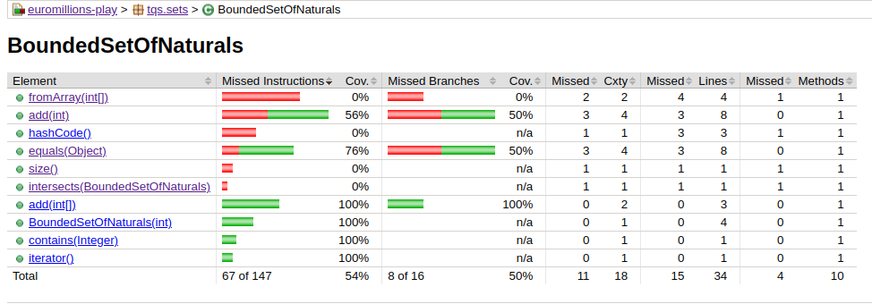
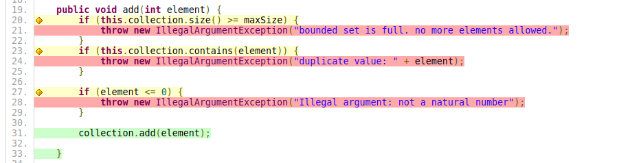
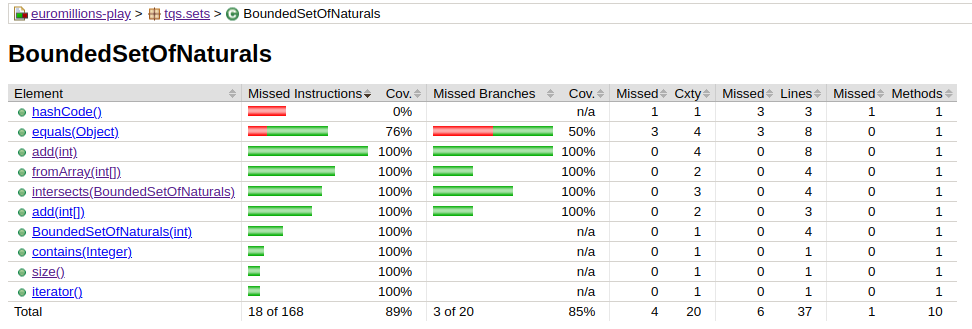

# Lab 1.2 Answers

Answers to questions on the Lab 1.2 section of the respective assignment, excluding those that rely exclusively on code implementation.

## 2c

### Coverage Analysis

The ```tqs``` package is not the intended target of these tests, so its coverage is, as expected, 0%.

The ```tqs.euromillions``` package has decent coverage with most of its missed instructions pertaining to boilerplate methods across several classes, e.g. hash code, getters, setters, toString methods. They are not normally tested as they're typically implemented automatically by the IDE with limited mistakes. 

Outside this class of methods, ```CuponEuromillions.format()```, ```CuponEuromillions.countDips()```, ```Dip.generateRandomDraw()``` have relatively simple implementations and lesser importance that don't demand as much attention, even if the ommission of ```CuponEuromillions.format()``` seems to contradict the inclusion of the ```format()``` method in the Dip class in testing.


Compared to the other packages, the ```tqs.sets``` package offers the least coverage, encompassing ```BoundedSetOfNaturals```, the least covered class:

- ```fromArray(int[])``` is never called (0%).
- ```add(int)``` is called, but none of its exception conditions occured (56%). This is mostly because one of test methods was disabled, which regardless didn't test 2 of the other exception conditions (branches).
- ```intersects(BoundedSetOfNaturals)``` is never called and has yet to be implemented (0%).





## 2d

After implementing the ```intersects(BoundedSetOfNaturals)``` method and refactoring existing tests on element addition in the context of the ```BoundedSetOfNaturals``` class, full coverage over relevant methods in the respective class is achieved:




