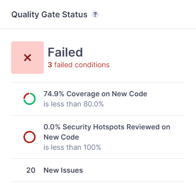
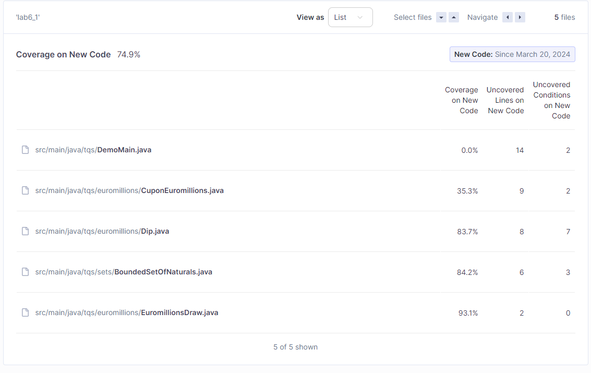
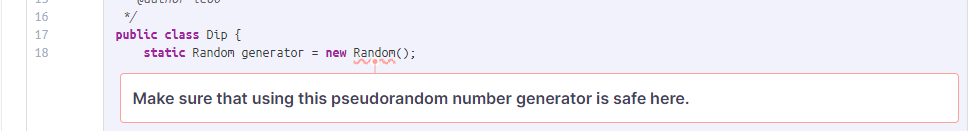

# Lab 6.1

## SonarQube Analysis Results

### Overview

The code repository for lab 2.1 failed the quality gate (Sonar Way) with 3 failed conditions:
- Code coverage is less than 80% (74.9%)
- No security hotspots reviewed
- Code has issues

### Low Coverage 

The main issue here is clear: coverage on DemoMain.java and CuponEuromillions.java is lacking, if even existent, in Demo's case. To solve this, DemoMain.java could be refactored into a JUnit test, while in CuponEuromillions.java 's case the issue comes mostly from its count() and format() methods with the latter being subject to testing.

### No reviewed Security Hotspots

A potential security risk arises from the usage of java.lang.Math.Random, but only if it's used in a security-sensitive context. In the case of a real Euromillions game, it can't be used as it is not sufficiently unpredictable to prevent game fraud. 

SonarQube proposes using java.security.SecureRandom instead for a cryptographically strong RNG.

### General Issues

Some of the most notable issues identified:

| Name | Type | Description | Solution | Code Reference |
| ----------- | ----------- | ----------- | ----------- | ----------- | 
| Reorder the modifiers to comply with the Java Language Specification | Minor code smell (bug) | Modifiers should be declared in the correct order | Swap "static" with "public" | src/main/java/tqs/euromillions/EuromillionsDraw.java ; line 29
| Refactor the code in order to not assign to this loop counter from within the loop body | Major code smell | "for" loop stop conditions should be invariant | Refactor to use a "while" loop instead of a "for" loop | src/main/java/tqs/euromillions/EuromillionsDraw.java ; line 42
| Extract the assignment out of this expression | Vulnerability | Assignments should not be made from within sub-expressions | Assign "ret" before the "if" block | src/main/java/tqs/euromillions/Dip.java ; line 74

