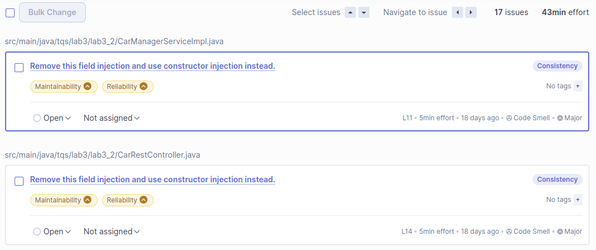
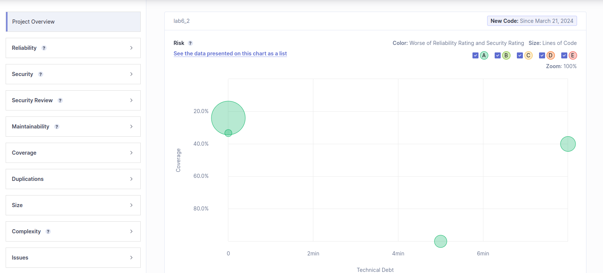
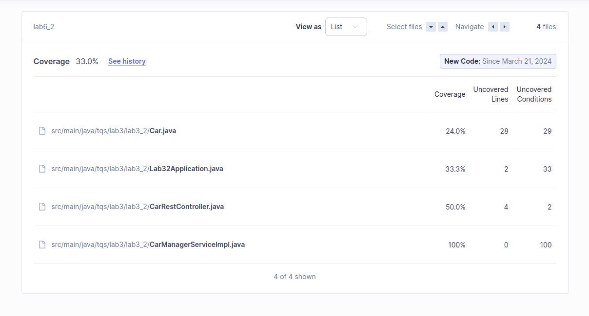

# Lab 6.2

## Report overview

SonarQube identified the following two issues as moderately severe:

### a) Technical Debt

The technical debt of a project can be defined as an estimate for the amount of time that is going to be spent debugging and reworking code in the future due to a compromise in software quality, perhaps in favour of speed in software delivery. 

In the last analysis, **43 minutes** were estimated for the project overall, though it must be noted that the two most severe issues only present the following technical debt, when isolated:

Note: The two rightmost circles represent the aforementioned most severe issues.

### b) Issues

The two most severe issues reported by SonarQube are of the same type, only differing in the code context where they occur. 

The issue consists of using the @Autowired field annotation for field injection, which is a code smell mainly due to the fact that it allows to create objects in invalid states (incompatability with final fields, uninitialized attributes...), difficulting testing.

To correct this issue, in both cases (CarManagerServiceImpl.java and CarRestController.java), the @Autowired annotation must be removed on the field and a constructor method must be written taking in the previously annotated field as an argument. Additionally, the constructor method should be annotated with @Autowired (it's only a bad practice in fields).

### c) Code Coverage

Code coverage results, as reported in the SonarQube dashboard:

These values are not good and they shouldn't have passed the quality gate (Sonar Way), in which there is a condition that invalidates code coverage below 80%, which is overall 33.0%. 

Looking into the uncovered code, only one seems to be more severe: the "get" mapping for the endpoint "/car/{id}". Other uncovered code pertains to hashCode, equals and toString methods, as well as the main method on Lab32Application.java. Redundant code that should be ignored with an exception rule on JaCoCo, given they were automatically generated by IDEs with tried-and-true methods.