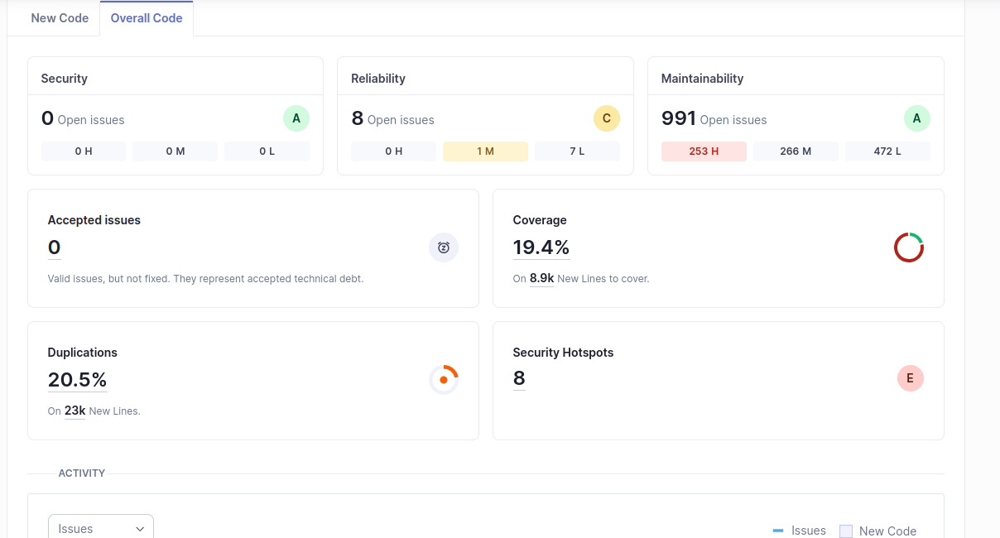
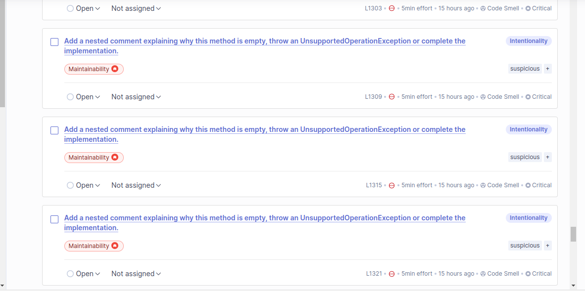
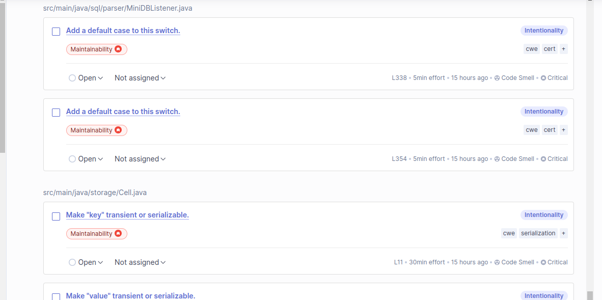
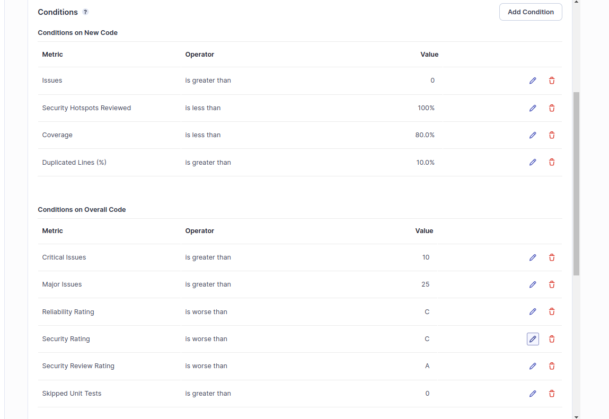
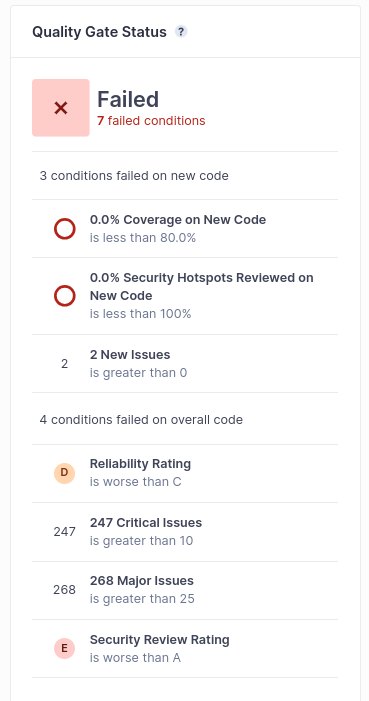
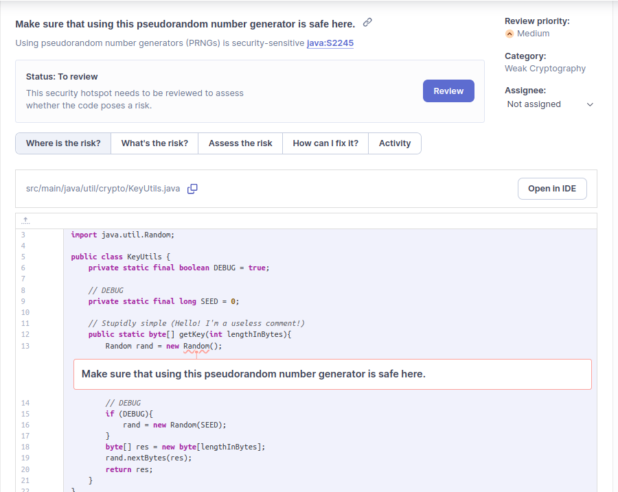

# Lab 6.3

## a) 

For this exercise, I decided to analyze an open-source Maven Java project: https://github.com/YehiaFarghaly/database-engine?tab=readme-ov-file

A database engine implemented in Java.

### SonarQube Analysis



Most problems are concentrated on Maintainability. Upon further inspection, a massive bulk of these critical issues are repeated:



These issues are concentrated on automatically generated code by the ANTLR parser generator tool, more specifically the **base class** (template) for traversing an abstract syntax tree. 

In my opinion, the issue in this very specific context doesn't need to be solved as the base class acts as a sort of interface/skeleton, similar to an abstract class. ANTLR4 may not be able to support an alternative abstract class approach for this scenario.

More concerning are issues that are associated to CWEs and represent software vulnerabilities, making up another decent portion:



In summary, issues are most concentrated on maintability, specifically related to security vulnerabilities, pitfalls and some clumsy/forgetful design.

### New Quality Gate metrics

SonarQube's default Quality Gate - Sonar Way - is a decent bandaid solution for most projects, but considering this is a database engine, expected to be used in critical situations, security and robustness are of the essence.

As such, the Sonar Way should be extended with gates pertaining to security and robustness:



#### Justification

- Critical and major issues: A low amount of critical and major issues may be acceptable, especially those not directly pertaining to security.

- Reliability rating: A "C" rating translates into at least 1 major bug. Minor vulnerabilities shouldn't represent a major threat to database functionality and reliability and so they may be tolerated for the time being.

- Security Rating: A "B" rating (**not pictured**) translates into 0 vulnerabilities - an appropriate rating since a database engine - one of the keystone components of most architectures and infrastructure, as well as one of the most popular subjects under attack in cybersecurity - should not come with significant vulnerabilities.

- Security Review: An "A" rating translates into >= 80% of security hotspots being reviewed. Similar to the previous point, it integrates into the high security standard that should be enforced when developing database engines.

- Duplicated Lines: The percentage was slightly raised to tolerate redundant code generated by ANTLR and other tools. Redundant classes or files could instead be excluded from the analysis scope instead for more accurate results.

## b)

To put this quality gate into action, an intentionally clumsy and unsafe software increment will be added to the project, attempting to develop an extremely simplified, naive and overall poorly designed pseudo-random cryptographic key generator, using the unsafe java.util.Random class.

Code:

```java
package util.crypto;

import java.util.Random;

public class KeyUtils {
    private static final boolean DEBUG = true;

    // DEBUG
    private static final long SEED = 0;

    // Stupidly simple (Hello! I'm a useless comment!)
    public static byte[] getKey(int lengthInBytes){
        Random rand = new Random();
        // DEBUG
        if (DEBUG){
            rand = new Random(SEED);
        }
        byte[] res = new byte[lengthInBytes];
        rand.nextBytes(res);
        return res;
    }
}

```

Quality Gate status:



Notably, this code is never tested and contains a security vulnerability (usage of cryptographically unsafe PRNG):




